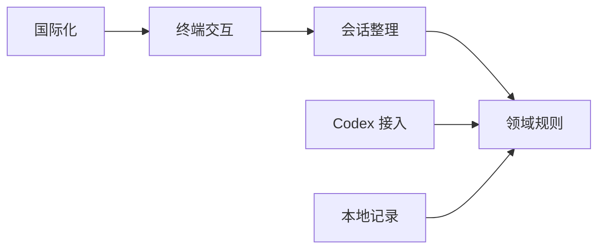

# Codex Vault — 项目蓝图

> 蓝图规范版本：4
> 文档定位：定义所有模块共同理解并长期遵守的项目级事实、唯一开发导航，以及用户明确沉淀的待开发工作。
> 事实来源：当前实现以代码、测试、迁移和配置为准；待开发目标以精确链接的设计为准。

## 1. 项目定位

| 对象 | 问题 | 成功结果 |
|------|------|----------|
| 使用本地 Codex 的 Linux 与 macOS 用户 | 长期积累的会话缺少可筛选、可恢复且能核对结果的安全整理入口 | 用户通过双语终端界面预览并整树归档、恢复或受控删除本机会话，并在可恢复门禁下清理已证明不再被任务目录使用的本机脏数据；任何写操作都服从兼容与保护门禁 |

## 2. 技术栈

| 类别 | 当前事实或硬约束 | 事实来源 |
|------|------------------|----------|
| 语言与运行 | Rust 2024 原生单文件，面向 Linux x86_64/ARM64 与 macOS Intel/Apple Silicon | [工程骨架契约](architecture/foundation/project-skeleton.md) |
| 终端界面 | Ratatui + Crossterm，中文与英文文案分离 | [工程骨架契约](architecture/foundation/project-skeleton.md) |
| 异步与协议 | Tokio 管理本地子进程和 JSONL；Serde 处理能力驱动的 Codex app-server 只读协议子集；会话状态变更委托服务器上的官方 Codex CLI | [app-server 协议子集](architecture/events/app-server-subset.yaml) |
| 持久化 | Rusqlite 管理自有偏好和操作记录，并聚合 Codex 状态库中的任务目录、关系和正文路径元数据；日常会话操作对 Codex 介质保持只读，脏数据维护仅在备份、确认和可核验恢复边界内直接修改已证明失效的 SQLite 记录、辅助索引或孤立正文文件 | [本地数据契约](architecture/data/local-session-data.md) |
| 发布 | MIT；GitHub Releases 发布四类二进制与 SHA-256，macOS MVP 不签名、不公证 | [工程骨架契约](architecture/foundation/project-skeleton.md) |

## 3. 代码结构

### 顶层目录

```text
src/                 Rust 产品代码与组合入口
locales/             中文和英文文案资源
tests/               跨层验收与脱敏协议场景
.github/workflows/   持续验证与四目标发布
.nova/               已确认需求、蓝图与共享架构契约
```

### 代码落位规则

| 代码区域 | 职责 | 代码落位规则 |
|----------|------|--------------|
| `src/domain/` | 会话树、资格、计划和结果不变量 | 只放无终端、协议和存储依赖的领域类型与规则 |
| `src/application/` | 扫描、筛选、预览、归档、恢复、删除和结果核对用例 | 只通过领域端口协调能力，不直接启动进程或访问数据库 |
| `src/ui/` | Ratatui 状态机、输入和渲染 | 只依赖应用用例、领域只读模型和国际化资源 |
| `src/adapters/codex/` | Codex 状态目录发现、app-server 运行态补齐、官方 CLI 会话状态变更、受控脏数据维护和跨介质结果核验 | 任务目录以当前主机有效的 Codex SQLite 状态库为准，app-server 只补充运行态和核验可见状态；归档、恢复和正常删除只调用同一主机上的官方 Codex CLI；脏数据维护只能处理已证明不再属于有效任务目录的数据，并负责备份、事务、恢复与重扫核验；不得把协议、命令或存储细节泄漏到领域层 |
| `src/adapters/storage/` | Codex Vault 自有 SQLite、迁移和保留期处理 | 只实现本地偏好与操作记录端口，不保存 Codex 会话正文 |
| `src/i18n/` 与 `locales/` | 语言选择、文案键和双语资源 | 文案键稳定，禁止在领域和适配器中硬编码用户提示 |
| `src/main.rs` | 进程入口和依赖组合 | 只负责配置各层、终端恢复和受控退出，不承载业务规则 |
| `tests/` | 跨层验收、协议 Mock 和故障场景 | 通过公开用例和可替换端口验证，不连接真实用户会话执行写操作 |
| `.github/workflows/` | 持续验证与 GitHub Releases | 只定义构建、测试、打包、校验和与发布门禁，不保存签名凭据 |

## 4. 模块职责

### 模块职责

| 模块 | 职责 | 对外边界 |
|------|------|----------|
| 终端交互 | 展示列表、筛选、选择、预览、确认、结果和历史 | 调用应用用例并展示领域结果，不直接操作 Codex 或本地数据 |
| 会话整理 | 计算完整会话树、资格、不可变操作计划和执行结果 | 暴露扫描、预览、归档、恢复、删除与核对用例 |
| Codex 接入 | 从当前主机 Codex 状态库发现完整任务目录和关系，以 app-server 补齐运行态并核验可见状态，通过官方 Codex CLI 请求会话状态变更，并维护已证明失效的本机 Codex 数据 | 向会话整理模块提供类型化快照；发现阶段只读访问任务元数据、关系、正文路径和辅助索引覆盖，不读取消息正文；归档、恢复和正常删除只走官方 Codex CLI；脏数据维护通过可恢复的本机介质操作执行 |
| 本地记录 | 保存偏好、待执行批次、逐会话结果和九十天保留期 | 向会话整理模块提供事务化记录端口，不拥有 Codex 会话状态 |
| 国际化 | 依据环境和用户选择提供中文或英文文案 | 只暴露稳定文案键和值，不参与业务判断 |



## 5. 公共约束

### 全局契约

| 契约 | 适用范围 | 验证 |
|------|----------|------|
| C-01 | 所有模块：Codex 所有权 | 有效会话及归档状态只由当前主机上的官方 Codex CLI 改变；Codex Vault 只有在任务目录、关系和路径证据足以证明数据失效，且已经生成可恢复备份、完成预览和明确确认时，才可直接维护本机状态库、辅助索引和孤立正文；客户端缓存仍不跨主机改写，凭据和有效会话正文始终禁止直接修改 |
| C-02 | Codex 接入、会话整理、终端交互：能力门禁 | 状态库目录、任务 ID、关系或正文路径覆盖不完整，官方 CLI 状态变更命令不可用，或运行态无法可靠判定时禁用受影响范围的会话写操作；脏数据维护还要求分类证据完整、目标在执行前未漂移且备份介质可写；能够可靠归属到单棵树的异常只保护该树，无法确定影响范围时才全局只读 |
| C-03 | 会话整理、Codex 接入：完整树 | 计划中的根与全部后代构成闭包；状态库任务目录与父子关系是范围主来源，app-server metadata-only 读取可补充运行态但不得缩小目录范围；未知关系、受保护节点或预览漂移使受影响整树失去资格 |
| C-04 | 会话整理、本地记录：预写计划 | 写操作前存在不可变待执行批次；本地记录不可写时不调用状态变更 |
| C-05 | 所有模块：实际结果 | 官方 CLI 结果以及状态库目录、正文路径、辅助索引、关联记录和 app-server 可见状态的重扫共同确定逐项结果；脏数据维护还必须核验备份可恢复、目标已移除且未影响有效目录；部分成功或客户端缓存滞后不得聚合为整体成功 |
| C-06 | 本地记录、Codex 接入、终端交互：最小数据 | 自有数据库只含偏好、时间、动作、会话 ID 和结果；Codex 接入只解析筛选、完整性和脏数据归属判断所需的任务元数据、关系和路径，不读取消息正文或凭据；备份可以保存待清理文件或数据库的原始不透明副本，但不得解析、展示或长期复制其正文内容 |
| C-07 | 进程入口、终端交互：终端恢复 | 正常退出、错误和中断路径均恢复终端；执行中的真实状态通过下次重扫核对 |
| C-08 | 发布流程：发布完整性 | 四目标产物均通过测试并附 SHA-256；macOS 未签名边界和放行步骤必须公开说明 |

### 开发决策边界

| 边界 | 内容 |
|------|------|
| 本期必须实现 | Rust 单文件双语 TUI、Codex SQLite 任务目录发现、app-server 运行态补齐、元数据筛选、完整树预览、归档与恢复、受控删除、已证明失效的本机脏数据清理、跨介质结果核验、SQLite 偏好和操作记录、四目标 GitHub Releases |
| 明确不做 | Windows、远程 app-server、WebSocket、常驻服务、消息正文读取或改写、有效 Codex 任务的内部数据库写入、跨主机修改客户端缓存、通用日志或缓存清理、自动更新、crates.io 发布、macOS 签名与公证 |
| 后续候选 | Windows、包管理器与 crates.io、远程会话、签名公证、脚本化入口，以及不属于已识别 Codex 脏数据的通用磁盘空间清理能力 |
| AI 可自行决定 | 不改变领域不变量和外部行为的内部函数拆分、终端配色、局部组件、查询实现与测试组织 |
| 必须再次确认 | 修改需求语义、增加外部服务或网络监听、读取消息正文、用内部存储执行状态变更、自有持久化新增字段、改变操作门禁、增加平台或发布渠道、引入签名凭据和显著运行依赖 |

### 分层与代码映射

| 层 | 职责 | 对应代码结构 | 允许依赖 |
|----|------|--------------|----------|
| 组合层 | 启动、连接各实现、恢复终端与退出 | `src/main.rs` | 终端交互、应用、适配器、国际化 |
| 表现层 | TUI 状态机、输入、渲染与本地化 | `src/ui/`、`src/i18n/`、`locales/` | 应用层、领域层 |
| 应用层 | 编排扫描、预览、执行、重扫和恢复 | `src/application/` | 领域层定义的类型与端口 |
| 领域层 | 会话树、资格、计划、结果和保护不变量 | `src/domain/` | Rust 标准库 |
| 基础设施层 | Codex 状态目录与关系的只读聚合、app-server 运行态协议、官方 CLI 变更、跨介质核验及自有 SQLite 的端口实现 | `src/adapters/codex/`、`src/adapters/storage/` | 领域端口及各自专用库 |
| 验证与发布层 | 跨层场景、构建和发布门禁 | `tests/`、`.github/workflows/` | 产品公开用例、脱敏 Mock、构建工具 |

> 所有实现代码均须映射到上述层级并服从允许依赖；模块所有权不豁免代码落位和依赖方向。

### 数据与资源安全

| 适用范围 | 不变量 | 验证 |
|----------|--------|------|
| Codex 会话 | 按有效 `CODEX_HOME` 与 SQLite 位置解析状态目录，以最新兼容状态库作为任务目录和关系主来源；app-server 只补充运行态；正文与索引只核验 ID、路径和存在性；有效会话状态变更通过官方 Codex CLI；脏数据维护只作用于已证明失效的记录或文件，并先建立可恢复副本；绝不读取 `auth.json` 或消息正文语义 | 协议、CLI、状态库与脱敏文件树 Mock 覆盖缺库、缺列、非法路径、重复 ID、索引不一致、递归正文路径、活动节点、部分归档、部分删除、目标漂移、备份和恢复失败 |
| 自有 SQLite | 只保存允许字段；写操作先记录计划；保留期清理不影响 Codex 状态 | 数据契约测试、迁移测试、损坏与只读文件测试 |
| 子进程与 JSONL | 单次运行拥有一个子进程；消息和队列有界；异常退出不遗留后台进程 | 超时、畸形消息、背压、中断和子进程退出测试 |
| 终端 | 任何退出路径恢复原始终端状态 | 正常、错误和中断验收测试 |
| 发布产物 | 构建不包含凭据；下载内容可由校验和验证 | 发布矩阵与产物内容检查 |

### 运行与恢复

| 资源或失败点 | 所有者 | 恢复与清理 |
|--------------|--------|------------|
| app-server 无法启动或握手失败 | Codex 接入 | 终止子进程并返回只读原因，不进入会话写流程 |
| 官方 Codex CLI 状态变更命令不可用、失败或超时 | Codex 接入 | 返回逐项失败并保留真实错误；由应用层重扫状态库、正文路径、辅助索引、关联记录和 app-server 可见状态，不直接补写 Codex 数据 |
| 状态库缺失、模式不兼容或目录覆盖不完整 | Codex 接入 | 保留可安全展示的元数据并禁用受影响范围的写操作；不得退回仅扫描顶层 `sessions/*.jsonl` |
| 脏数据分类、备份或执行失败 | Codex 接入、本地记录 | 分类证据不足时不提供清理资格；备份未完成时不修改源数据；执行中断时保留备份和逐项实际结果，下次启动先重扫并允许恢复或重试；不得直接删除 SQLite 的 WAL/SHM 文件 |
| app-server 缺失任务或置顶字段 | Codex 接入 | 不缩小状态库目录；缺少运行态或保护位的任务保持只读，其他已完整核验的树可继续操作 |
| 客户端本地目录缓存滞后 | 客户端 Codex | 服务端结果标记为等待客户端刷新；提示重启或在客户端本机核验，不从服务端跨主机改写缓存 |
| 预览后状态变化 | 会话整理 | 执行前重读整树并拒绝漂移计划，要求用户重新预览 |
| 归档返回成功但后代通知不完整 | 会话整理 | 重列活动和归档状态，逐项记录实际结果并允许重试 |
| SQLite 不可写或迁移失败 | 本地记录 | 隔离损坏文件；无法可靠记录计划时阻止写操作，不修改 Codex 状态 |
| 执行中断或进程崩溃 | 会话整理、本地记录 | 下次启动重扫 Codex 状态并把待执行批次标记为中断，禁止推断未观察结果 |
| 终端异常或退出 | 终端交互、组合层 | 无条件恢复终端模式并终止所拥有的子进程 |
| 发布目标失败 | 发布流程 | 不发布不完整版本；保留已验证构建日志供定位，不生成部分 Release |

## 6. 开发导航

| 开发触发条件 | 名称 | 类别 | 精确入口 | 复用或遵循边界 | 验证入口 |
|--------------|------|------|----------|----------------|----------|
| 修改技术栈、目录依赖、运行形态、目标平台或发布流程时 | 工程骨架与发布边界 | 详细共享契约 | [工程骨架契约](architecture/foundation/project-skeleton.md) | 遵循 Rust 单进程 TUI、分层依赖、四目标发布及 macOS 不签名不公证边界 | [Cargo 配置](../Cargo.toml)、[发布工作流](../.github/workflows/release.yml) |
| 修改 Codex app-server 生命周期、只读协议字段、运行态补齐或 CLI 状态变更时 | Codex 只读协议与 CLI 状态变更 | 详细共享契约 | [app-server 协议子集](architecture/events/app-server-subset.yaml) | 状态库目录不得被 app-server 列表缩小；缺失 ID 只以 metadata-only read 补齐运行态；状态变更只走当前主机官方 Codex CLI | [Codex 适配器及测试](../src/adapters/codex/mod.rs) |
| 修改本地偏好、操作记录、Codex 目录聚合或跨介质清理核验时 | 本地会话与操作数据 | 详细共享契约 | [本地数据契约](architecture/data/local-session-data.md) | 自有数据与 Codex 数据分属不同所有者；任务元数据、关系、路径和索引只读，消息正文、凭据和 Codex 内部存储禁止写入 | [Codex 与存储适配器测试](../src/adapters/codex/mod.rs) |

## 7. 待开发工作

当前无待开发工作。
